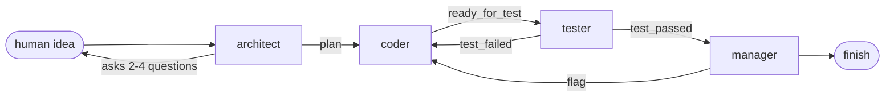

# Dev Crew

Four AI agents that build a small piece of software from a one-line idea, handing work to
each other like a real team: an **architect** plans it, a **coder** writes it, a **tester**
tries to break it, and a **manager** decides whether it ships.

The agents never call each other directly. They communicate only by leaving messages on an
append-only SQLite bus, and a scheduler wakes whoever has unread mail. That one constraint is
what makes the whole run replayable after the fact — the bus *is* the state.

Built on the [Claude Agent SDK](https://docs.claude.com/en/api/agent-sdk/overview).

```
python -m crew.run "a CLI that converts CSV to a formatted markdown table"
```

## How a run works



Every round, the scheduler looks for an agent with unread mail, gives it **exactly one turn**,
and moves on. An agent does its work, sends its messages, and stops — it never loops or waits.
The run ends when the manager calls `finish`, or when a guard trips.

Roles are plain data in [`crew/roles.py`](crew/roles.py), so adding a fifth agent is a new dict
entry rather than a subclass:

| agent | model | can do | turn / budget cap |
|---|---|---|---|
| architect | Opus, high effort | `Read`, ask the human, send | 8 turns · $0.75 |
| coder | Sonnet, medium effort | `Read` `Write` `Edit` `Bash` `Glob` `Grep`, send | 30 turns · $1.25 |
| tester | Sonnet, medium effort | `Read` `Write` `Bash` `Glob` `Grep`, send | 30 turns · $1.00 |
| manager | Opus, high effort | `Read` `Glob` `Grep`, send, `finish` | 8 turns · $0.75 |

The manager has no write tools at all — no `Write`, no `Edit`, no `Bash` — so its read-only
role is enforced by the tool list alone.

The tester is the interesting one, and the earlier version of this README got it wrong. It said
the tester "has `Write` but not `Edit`, so it cannot quietly patch the coder's implementation".
That was backwards: **`Write` replaces a file wholesale, so it is a more complete patch than
`Edit`, not a lesser one.** Removing `Edit` removed the weaker of the two operations and the
README called the result enforcement.

What enforces it now is `crew/guards.py`, wired in as the SDK's `can_use_tool` callback: the
tester's `Write`/`Edit`/`MultiEdit`/`NotebookEdit` calls are denied unless the target resolves
under `tests/`. It resolves `..` textually, understands both path separators, handles absolute
paths inside the workspace, and **fails closed** — a write whose target cannot be parsed is
refused, because a guard that waves through what it does not understand is the thing it exists
to prevent. `permission_mode="bypassPermissions"` skips the interactive prompt but `can_use_tool`
still runs, which is what makes this the one place a per-role boundary can actually live.

**`Bash` is deliberately not guarded, and that is the honest limit of this.** A shell is a
universal write primitive: `echo x > app/calc.py` defeats any path check, and pattern-matching
commands to look like a guarantee would be the same theatre this replaced. The tester needs
`Bash` to run pytest, so `Bash` stays open and this paragraph exists instead of a claim that
does not hold. Closing it needs OS-level sandboxing, which the SDK provides on macOS and Linux
but not on Windows — see the caveat in `CLAUDE.md`.

So: the manager's boundary is enforced by the tool list, the tester's file writes are enforced
by a path guard, and the tester's shell is not enforced at all. Three different strengths, named
separately, because collapsing them into "enforced by which tools each role is given" is how the
first version of this README ended up asserting something false.

## Design decisions I'd defend in an interview

**The message table is append-only — no `UPDATE`, no `DELETE`, ever.** Read-tracking lives in a
separate `cursors` table. This is why any run can be replayed exactly, and why a UI can be a
pure renderer over the bus instead of a second source of truth.

**Agent memory is rebuilt from the bus, not held in an SDK session.** Each turn is a fresh
one-shot `query()`. The obvious implementation — keep a persistent client per agent — was
rejected because it moves memory somewhere the bus can't see, breaking both replayability and
the renderer seam. Instead, `Bus.history_for(run, agent)` returns every message an agent sent
or received, and `build_prompt` assembles a stable context prefix plus a volatile "act on these
now" suffix.

**Prompt serialization is deterministic — sorted keys, no timestamps.** The cost model depends
entirely on prompt caching, and caching needs a byte-stable growing prefix. A message that
serialized differently between turns would silently invalidate the cache and multiply the bill
without failing a single test. `Msg.to_prompt()` is deterministic on purpose.

**Sender identity is closure-bound, not passed as an argument.** When the crew's MCP tools are
built for an agent, that agent's name is captured in the closure. There is no `from` parameter
an agent could set to something else, so impersonation isn't blocked by validation — it's
structurally unavailable.

**Guards assume the loop will misbehave.** A turn cap, a soft budget ceiling, and a manager
brake that forces a decision after three `test_failed` bounces, so a coder and tester can't
ping-pong indefinitely on the same failure. The budget is deliberately a *soft* ceiling checked
per round: worst-case spend is the budget plus one round of per-turn caps, and the per-turn caps
are what bound the overshoot.

**Every agent runs with `setting_sources=[]`** so no global `CLAUDE.md` from the host machine
bleeds into an agent's context, and each is `cwd`-scoped to its own `runs/<id>/` sandbox.

## Honest limitations

- **The crew has never been run live end-to-end.** All 50 tests pass against `FakeAgent`s at
  $0 with no API calls. The plumbing, guards, and message flow are verified; the quality of
  what four real agents actually produce together is not. That run is the next step.
- **The sandboxing is weak on Windows.** The SDK's OS-level bash sandboxing is macOS/Linux
  only. On Windows the coder and tester run with `bypassPermissions` in a throwaway directory,
  which is fine for a learning project and *not* fine for pointing at anything real. WSL or a
  container is the fix, and it isn't done.
- **One model per agent per run.** Caches are model-scoped, so switching mid-run throws away
  the cache the cost model depends on.
- **The budget ceiling is soft**, per above — it can overshoot by roughly one round.

## Running it

```bash
python -m crew.run "<idea>"                  # flags: --budget 5.0 --turn-cap 24 --vault <dir>
python -m pytest tests/ -q                   # 50 tests, all $0 (FakeAgents, no API calls)
python -m ruff check crew/ tests/
```

`CREW_VAULT_DIR` sets the default vault directory for run records; `--vault` overrides it.
Each finished run appends a record to the vault so there's a durable log of what the crew was
asked for and what it produced.

A run ends in one of four states: `finished`, `turn_cap`, `budget_closed`, or `stalled`.

## Layout

```
crew/
  bus.py         append-only SQLite message bus + read cursors
  agent.py       one SDK turn per agent, prompt assembly, cost capture
  roles.py       the four roles as data: models, tools, prompts, caps
  tools.py       crew MCP tools (send_message / ask_human / finish)
  scheduler.py   the turn loop and every guard
  workspace.py   per-run sandbox directories
  report.py      run records written to the vault
  run.py         CLI entrypoint
docs/superpowers/specs/    design spec
docs/superpowers/plans/    implementation plan
```

Built by [Benjamin Choe](https://github.com/benjaminchoe123), Information Systems student at
UMBC. See also [threat-intel-pipeline](https://github.com/benjaminchoe123/threat-intel-pipeline).
